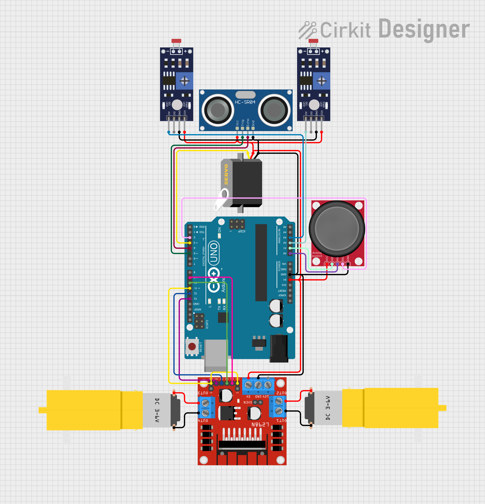

# Simulation Directory

This directory contains code for testing and simulating the RC car's functionality using [Circkit Designer IDE](https://app.cirkitdesigner.com/). The goal of this simulation is to replicate the behaviour of the RC car, which can either be manually controlled via a joystick (manual mode) or automatically navigate using line-following (automated mode).

The code in this directory is almost identical to the main project, with the exception of [simulation.ino](simulation.ino), which is specifically tailored for the simulation environment. This is due to the limitations of simulating a Bluetooth module in Circkit Designer.

## How to Run the Simulation
1. Open the [project link](https://app.cirkitdesigner.com/project/6ffc006c-47a4-40e7-8b82-333dc54fa5a7) in your browser. (Note: A 'Sign In' is optional unless you wish to modify or tinker with the project).
2. Navigate to the '**Simulate**' tab and click the green **play button** to start the simulation. All code from this directory has already been uploaded to the project and can be viewed under the '**Code**' tab.
3. The mode can be switched using the joystick '**Select**' button:
    - **Manual mode**: The directional joystick input controls the motors directly, allowing for manual movement of the car.
    - **Automatic mode**: The input parameters from the ultrasonic sensors and infrared sensors determine how the motors behave. You can adjust these parameters to simulate different scenarios, such as obstacle detection or line-following behavior.
---
For more detailed information about the project and hardware setup, refer to the main project [README.md](../README.md).